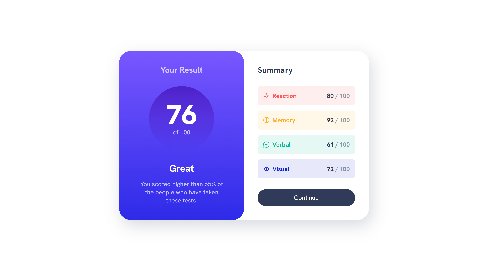

# Frontend Mentor - Results summary component solution

This is a solution to the [Results summary component challenge on Frontend Mentor](https://www.frontendmentor.io/challenges/results-summary-component-CE_K6s0maV). Frontend Mentor challenges help you improve your coding skills by building realistic projects. 

## Table of contents

- [Overview](#overview)
  - [The challenge](#the-challenge)
  - [Screenshot](#screenshot)
- [Author](#author)
- [Acknowledgments](#acknowledgments)

## Overview

### The challenge

Users should be able to:

- View the optimal layout for the interface depending on their device's screen size
- See hover and focus states for all interactive elements on the page
- **Bonus**: Use the local JSON data to dynamically populate the content

### Screenshot

## Author

- Frontend Mentor - [@jumiranda5](https://www.frontendmentor.io/profile/jumiranda5)

## Acknowledgments

For this challenge, I followed along the [video](https://www.youtube.com/watch?v=KqFAs5d3Yl8&t=16s) from [Kevin Powell](https://www.youtube.com/@KevinPowell) on youtube. I didn't change anything.